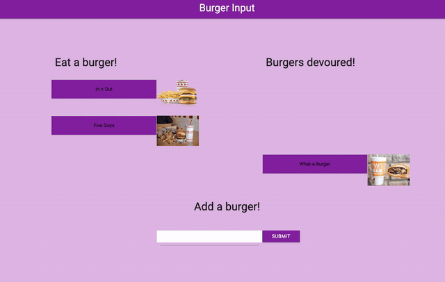

# Burger Input
here is my burger input full stack project. Using mysql, handlebars, orm, and an MVC layout I created this web page where you can eat your favorite burgers! 

##  Links
Git Hub Repository
https://github.com/rythomas2525/burgerinput
Heroku Deployed
https://mysterious-headland-58622.herokuapp.com/
Portfolio
https://ryanlthomas.com

## GIF

## Developed by Ryan Thomas
